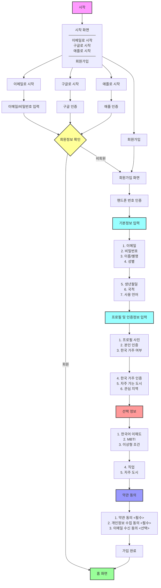

# 서울오빠 회원가입/로그인 플로우차트

> GitHub에서 이 파일을 열면 아래 Mermaid 다이어그램이 자동으로 렌더링됩니다.

## 플로우 설명

### 1. 시작 화면
- 사용자가 앱을 처음 실행하면 시작 화면이 표시됩니다.
- 상단에 세 가지 로그인 버튼:
  - **이메일로 시작**: 이메일 로그인
  - **구글로 시작**: 구글 계정 로그인
  - **애플로 시작**: 애플 계정 로그인
- 하단에 **회원가입** 버튼: 신규 회원 직접 가입

### 2. 로그인 프로세스
- **이메일로 시작**: 이메일과 비밀번호 입력
- **구글로 시작**: 구글 OAuth 인증
- **애플로 시작**: 애플 Sign in with Apple 인증
- 인증 후 회원정보 확인:
  - **기존 회원**: 홈 화면으로 이동
  - **비회원**: 회원가입 화면으로 이동

### 3. 회원가입 프로세스
- **회원가입 버튼** 또는 **비회원 로그인 시도** 시 회원가입 화면으로 이동

### 4. 회원가입 단계

#### 4.1 핸드폰 번호 인증
- SMS 인증을 통한 본인 확인

#### 4.2 기본정보 입력 (필수 7개)
1. 이메일 (본인인증용)
2. 비밀번호 (암호화 저장)
3. 이름(별명) - 최소 2자 이상
4. 성별 - 남/여/기타 선택
5. 생년월일 - 나이 자동 계산
6. 국적 - 여권상/현지인 보험여부
7. 사용 언어 - 언어 선택 + 레벨

#### 4.3 프로필 및 인증정보 (필수 6개)
1. 프로필 사진 - 1장 이상 업로드
2. 본인 사진 인증 - 신원 확인용
3. 한국 거주 여부
4. 한국 거주 인증 (거주자인 경우)
5. 자주 가는 도시
6. 관심 지역

#### 4.4 선택 정보 (선택 5개)
1. 한국어 이해 정도
2. MBTI
3. 이상형 조건
4. 직업
5. 자주 가는 도시 (추가)

### 5. 약관 동의
- 서비스 약관 동의 (필수)
- 개인정보 수집 및 이용 동의 (필수)
- 이메일 정보 수신 동의 (선택)

### 6. 가입 완료
- 모든 정보 입력 완료 후 홈 화면으로 이동